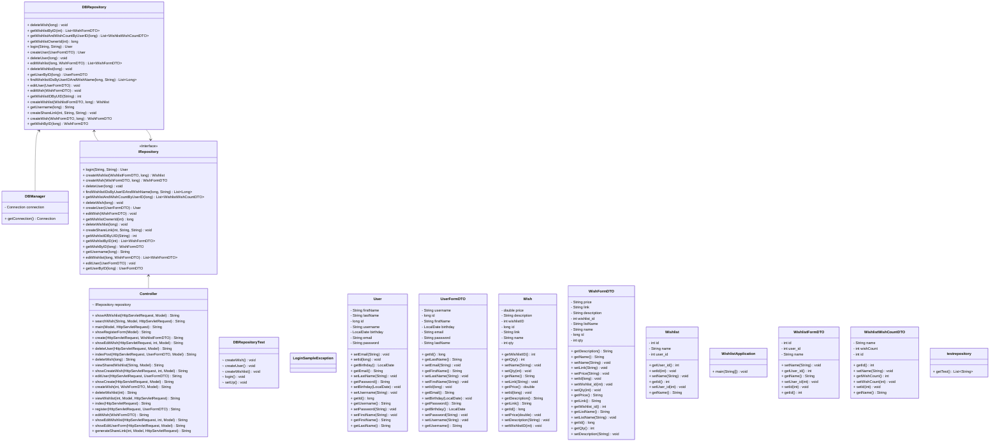

# Class Diagram made with Markdown and Mermaid

```mermaid
classDiagram
direction BT
class Controller {
  ~ IRepository repository
  + showAllWishlist(HttpServletRequest, Model) String
  + searchWish(String, Model, HttpServletRequest) String
  + main(Model, HttpServletRequest) String
  + showRegisterForm(Model) String
  + create(HttpServletRequest, WishlistFormDTO) String
  + showEditWish(HttpServletRequest, int, Model) String
  + deleteUser(HttpServletRequest, Model) String
  + indexPost(HttpServletRequest, UserFormDTO, Model) String
  + deleteWish(long) String
  + viewSharedWishlist(String, Model) String
  + showCreateWish(HttpServletRequest, int, Model) String
  + editUser(HttpServletRequest, UserFormDTO) String
  + showCreate(HttpServletRequest, Model) String
  + createWish(int, WishFormDTO, Model) String
  + deleteWishlist(int) String
  + viewWishlist(int, Model, HttpServletRequest) String
  + index(HttpServletRequest) String
  + register(HttpServletRequest, UserFormDTO) String
  + editWish(WishFormDTO) String
  + showEditWishlist(HttpServletRequest, int, Model) String
  + showEditUserForm(HttpServletRequest, Model) String
  + generateShareLink(int, Model, HttpServletRequest) String
}
class DBManager {
  - Connection connection
  + getConnection() Connection
}
class DBRepository {
  + deleteWish(long) void
  + getWishlistByID(int) List~WishFormDTO~
  + getWishlistAndWishCountByUserID(long) List~WishlistWishCountDTO~
  + getWishlistOwnerId(int) long
  + login(String, String) User
  + createUser(UserFormDTO) User
  + deleteUser(long) void
  + editWishlist(long, WishFormDTO) List~WishFormDTO~
  + deleteWishlist(long) void
  + getUserByID(long) UserFormDTO
  + findWishlistIDsByUserIDAndWishName(long, String) List~Long~
  + editUser(UserFormDTO) void
  + editWish(WishFormDTO) void
  + getWishlistIDByUID(String) int
  + createWishlist(WishlistFormDTO, long) Wishlist
  + getUsername(long) String
  + createShareLink(int, String, String) void
  + createWish(WishFormDTO, long) WishFormDTO
  + getWishByID(long) WishFormDTO
}
class DBRepositoryTest {
  ~ createWish() void
  ~ createUser() void
  ~ createWishlist() void
  ~ login() void
  ~ setUp() void
}
class IRepository {
<<Interface>>
  + login(String, String) User
  + createWishlist(WishlistFormDTO, long) Wishlist
  + createWish(WishFormDTO, long) WishFormDTO
  + deleteUser(long) void
  + findWishlistIDsByUserIDAndWishName(long, String) List~Long~
  + getWishlistAndWishCountByUserID(long) List~WishlistWishCountDTO~
  + deleteWish(long) void
  + createUser(UserFormDTO) User
  + editWish(WishFormDTO) void
  + getWishlistOwnerId(int) long
  + deleteWishlist(long) void
  + createShareLink(int, String, String) void
  + getWishlistIDByUID(String) int
  + getWishlistByID(int) List~WishFormDTO~
  + getWishByID(long) WishFormDTO
  + getUsername(long) String
  + editWishlist(long, WishFormDTO) List~WishFormDTO~
  + editUser(UserFormDTO) void
  + getUserByID(long) UserFormDTO
}
class LoginSampleException
class User {
  - String firstName
  - String lastName
  - long id
  - String username
  - LocalDate birthday
  - String email
  - String password
  + setEmail(String) void
  + setId(long) void
  + getBirthday() LocalDate
  + getEmail() String
  + setLastName(String) void
  + getPassword() String
  + setBirthday(LocalDate) void
  + setUsername(String) void
  + getId() long
  + getUsername() String
  + setPassword(String) void
  + setFirstName(String) void
  + getFirstName() String
  + getLastName() String
}
class UserFormDTO {
  - String username
  - long id
  - String firstName
  - LocalDate birthday
  - String email
  - String password
  - String lastName
  + getId() long
  + getLastName() String
  + setEmail(String) void
  + getFirstName() String
  + setLastName(String) void
  + setFirstName(String) void
  + setId(long) void
  + getEmail() String
  + setBirthday(LocalDate) void
  + getPassword() String
  + getBirthday() LocalDate
  + setPassword(String) void
  + setUsername(String) void
  + getUsername() String
}
class Wish {
  - double price
  - String description
  - int wishlistID
  - long id
  - String link
  - String name
  - int qty
  + getWishlistID() int
  + getQty() int
  + setName(String) void
  + setQty(int) void
  + getName() String
  + setLink(String) void
  + getPrice() double
  + setId(long) void
  + getDescription() String
  + getLink() String
  + getId() long
  + setPrice(double) void
  + setDescription(String) void
  + setWishlistID(int) void
}
class WishFormDTO {
  - String price
  - String link
  - String description
  - int wishlist_id
  - String listName
  - String name
  - long id
  - int qty
  + getDescription() String
  + getName() String
  + setName(String) void
  + setLink(String) void
  + setPrice(String) void
  + setId(long) void
  + setWishlist_id(int) void
  + setQty(int) void
  + getPrice() String
  + getLink() String
  + getWishlist_id() int
  + getListName() String
  + setListName(String) void
  + getId() long
  + getQty() int
  + setDescription(String) void
}
class Wishlist {
  - int id
  - String name
  - int user_id
  + getUser_id() int
  + setId(int) void
  + setName(String) void
  + getId() int
  + setUser_id(int) void
  + getName() String
}
class WishlistApplication {
  + main(String[]) void
}

class WishlistFormDTO {
  - int id
  - int user_id
  - String name
  + setName(String) void
  + getUser_id() int
  + getName() String
  + setUser_id(int) void
  + setId(int) void
  + getId() int
}
class WishlistWishCountDTO {
  - String name
  - int wishCount
  - int id
  + getId() int
  + setName(String) void
  + getWishCount() int
  + setWishCount(int) void
  + setId(int) void
  + getName() String
}
class testrepository {
  + getTest() List~String~
}

DBRepository  -->  IRepository 
Controller --> IRepository
IRepository --> DBRepository
DBManager --> DBRepository
```
